# K2K Traceability — Complete Project Evolution Report

**Document Type:** Software Architecture Design Document (SADD)  
**Version:** 2.1  
**Date:** July 16, 2026  
**Repository:** `k2k_traceability`  
**Current Branch:** `main` @ `daab351` (+ local uncommitted simplification)  
**Status:** **Nested-only architecture** — `productCategory` / batches / packets + server-side legacy-admin APIs. Flat traceability platform **removed** (Jul 2026). Flat Firestore data **purged** — 220 documents deleted Jul 16, 2026 (`kisan2kitchen-1a068`).

---

## Table of Contents

1. [Project Overview](#section-1-project-overview)
2. [Original Architecture](#section-2-original-architecture)
3. [Original Folder Structure](#section-3-original-folder-structure)
4. [File-by-File Analysis (OLD)](#section-4-file-by-file-analysis-old)
5. [Original Execution Flow](#section-5-original-execution-flow)
6. [Problems Found](#section-6-problems-found)
7. [Why Each Change Was Made](#section-7-why-each-change-was-made)
8. [File-by-File Changes](#section-8-file-by-file-changes)
9. [Folder Structure Changes](#section-9-folder-structure-changes)
10. [Architecture Changes](#section-10-architecture-changes)
11. [Admin Module](#section-11-admin-module)
12. [Customer Module](#section-12-customer-module)
13. [Database Changes](#section-13-database-changes)
14. [Authentication Changes](#section-14-authentication-changes)
15. [API Changes](#section-15-api-changes)
16. [Security Changes](#section-16-security-changes)
17. [Performance Changes](#section-17-performance-changes)
18. [Complete Data Flow](#section-18-complete-data-flow)
19. [Complete Before vs After Table](#section-19-complete-before-vs-after-table)
20. [Developer Onboarding](#section-20-developer-onboarding)
21. [Final Architecture](#section-21-final-architecture)
22. [Appendix A — Current Folder Tree](#appendix-a--complete-current-folder-tree-jul-2026)
23. [Appendix B — NEW File-by-File Analysis](#appendix-b--new-architecture-file-by-file-analysis)
24. [Appendix C — Complete API Reference](#appendix-c--complete-api-route-reference)
25. [Appendix D — File Dependency Diagram](#appendix-d--file-dependency-diagram)
26. [Appendix E — Glossary](#appendix-e--glossary)

---

## Evolution Timeline

```
Jun 2025  ──► Monolithic client Firestore app (firebaseUtil.tsx)
Jul 2025  ──► Landing page, UI refactors, deployment fixes
Sep 2025  ──► Firebase Auth + Admin SDK + user APIs + middleware
May 2026  ──► Traceability platform added (flat collections, QR) — later removed
Jul 2026  ──► Customer portal polish + legacy-admin server API migration
Jul 2026  ──► **Simplification:** removed flat/traceability; nested-only final state
Jul 16 2026 ──► **Data purge:** deleted 220 docs from flat collections in Firestore
```

## Current Architecture (Final — Jul 2026)

The project uses a **single nested Firestore model**. Top-level flat `batches`/`packets` collections are **empty** (purged Jul 16, 2026). No QR scan flow and no dual-write.

```
Admin  → /api/admin/*        → legacy-admin/     → productCategory/batches/packets
Customer → /api/customer/resolve-serial → customer-serial-resolve.ts → serialNumbers → nested docs
Auth   → Firebase Auth + JWT custom claims + /api/auth/set-claims
```

| Layer | Technology |
|-------|------------|
| Frontend | Next.js 14, React, TypeScript, Tailwind, shadcn/ui |
| Admin data | `src/lib/legacy-admin/` + `/api/admin/products/*` |
| Customer lookup | `src/lib/customer-serial-resolve.ts` + `/api/customer/resolve-serial` |
| Auth | `AuthContext`, `api-auth.ts`, `users` collection, JWT claims |
| Database | Nested `productCategory` + `serialNumbers` index + `users` |
| Storage | Firebase Storage (`products/`, `testReport/`) |

**Removed in simplification (Jul 2026):**
- `src/lib/traceability/` (entire module)
- `src/app/api/traceability/*` (all routes)
- `/admin/traceability/*` (operator dashboard)
- `/scan/[token]` (QR page)
- `traceability-client.ts`, `TraceabilityAdminShell.tsx`
- `scratch/migrate_legacy_to_flat.js`
- Flat collection Firestore rules and indexes
- `syncFlatPackets` dual-write in `useBatchDetails`
- **Flat Firestore data** (220 documents): `traceabilityRoots` (6), `batches` (2), `packets` (60), `traceabilityEvents` (62), `qrAliases` (90) — purged via `scratch/delete_flat_traceability_collections.js`

**Git commits (13 total, linear `main`):**

| Hash | Date | Message | Architectural significance |
|------|------|---------|---------------------------|
| `d35762c` | 2025-06-21 | initial commit | Client-side Firestore monolith |
| `de474cc` | 2025-07-14 | pagechange | Landing/branding |
| `dfcdd44` | 2025-07-14 | Merge PR #1 | Integrate feature/risha |
| `d1e2374`/`c870945` | 2025-07-18 | deployment fixes | Turbulent deploy window |
| `e902eb4` | 2025-07-18 | Enhance admin panel | UI/types |
| `8ee022a` | 2025-09-08 | Firebase Auth + Admin SDK | Server auth layer |
| `501bc95` | 2026-05-14 | feat: traceability module | Flat platform added (later removed Jul 2026) |
| `9c747a0` | 2026-07-09 | customer search portal | UX polish |
| `daab351` | 2026-07-09 | admin panel commit | Minor cleanup |

---

# SECTION 1 — PROJECT OVERVIEW

## What is K2K Traceability?

**K2K Traceability** (also branded **UniVillage Agro Traceability**) is a web-based product traceability platform built for natural/organic food products (mustard oil, cow ghee, honey, tea, etc.). It enables end-to-end tracking from manufacturing through consumer verification.

**Tech stack:**
- **Frontend:** Next.js 14 (App Router), React 18, TypeScript, Tailwind CSS, Radix UI (shadcn), Framer Motion
- **Backend:** Next.js API Routes + Firebase Admin SDK
- **Database:** Firebase Firestore (NoSQL)
- **Storage:** Firebase Storage (product images, lab test reports)
- **Auth:** Firebase Authentication (email/password, phone OTP)

## What Problem Does It Solve?

| Problem | Solution |
|---------|----------|
| Counterfeit/adulterated products | Unique serial numbers + lab test data per bottle |
| No supply chain visibility | Batch → packet lineage with test reports |
| Consumer distrust | Public serial lookup showing authenticity |
| Manual record-keeping | Admin portal for products, batches, packets |

## Who Uses It?

### Admin (`role: admin`)
- Creates product categories (mustard oil, ghee, honey)
- Creates production batches with quantity limits
- Generates individual packets (bottles) with unique serial numbers
- Uploads batch lab test reports (PDF)
- Records refractometer/quality readings per packet
- Manages the product catalog at `/admin`

### Customer / Consumer (public, no login required)
- Enters bottle serial number at `/customer`
- Views product name, batch number, quality report, lab test PDF link
- Sees "YOUR PRODUCT IS AUTHENTIC & TESTED" verification UI

### Farmer
- **Not a separate role in the current codebase.** Operational users are admins.

## Complete Business Flow

```
┌─────────────┐     ┌──────────────┐     ┌─────────────┐     ┌──────────────┐
│  Admin      │────►│  Product     │────►│  Batch      │────►│  Packets     │
│  Login      │     │  Category    │     │  Creation   │     │  Generation  │
└─────────────┘     └──────────────┘     └─────────────┘     └──────────────┘
                                                                    │
                    ┌───────────────┐     ┌───────────────┐          │
                    │  Consumer     │◄────│  Serial on    │◄─────────┘
                    │  Verification │     │  Label        │
                    └───────────────┘     └───────────────┘
```

**Step-by-step business flow:**

1. **Product onboarding** — Admin adds a product category (e.g., "Pure Mustard Oil") with image and description. System assigns `productCategoryId` (e.g., `001`).
2. **Batch production** — Admin creates a batch for that product with `limitQuantity` and optional lab test report PDF.
3. **Packet labeling** — Admin generates N packets. Each packet gets `packetNo` (`001`, `002`, …) and a **serial number** = `{productCategoryId}{batchNo}{packetNo}` (e.g., `001002003` = product 001, batch 002, packet 003).
4. **Quality testing** — Per-packet refractometer reading recorded (mustard: 2.3—2.8, ghee: 40—45 BR, honey: 17—20% moisture).
5. **Label printing** — Serial number printed on bottle label.
6. **Consumer purchase** — Consumer enters serial on `/customer`.
7. **Verification** — System resolves serial → product + batch + packet → displays authenticity and quality data.

---

# SECTION 2 — ORIGINAL ARCHITECTURE

## Overview (June 2025 — Initial Commit `d35762c`)

The original system was a **pure client-side Firebase application**. The browser talked directly to Firestore and Storage. There were **no API routes**, **no middleware**, **no server-side validation**, and **no authentication**.

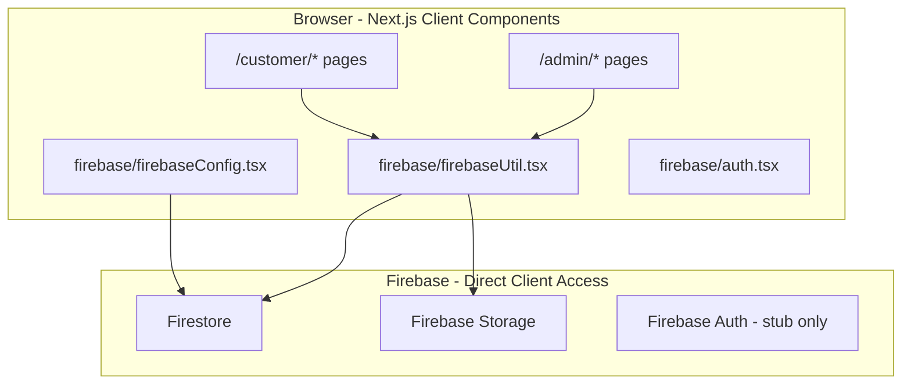

## Frontend (Original)

- **Framework:** Next.js 14 App Router with `"use client"` on all data pages
- **UI:** shadcn/ui components in `src/components/ui/`
- **State:** Local `useState`/`useEffect` per page — no global state management
- **Data access:** Every admin and customer page imported functions from `firebase/firebaseUtil.tsx`

## Backend (Original)

**There was no backend.** All CRUD operations ran in the browser using the Firebase client SDK (`firebase/firestore`, `firebase/storage`).

## Firebase (Original)

| Service | Usage |
|---------|-------|
| Firestore | Products, batches, packets, serial index |
| Storage | `products/{uuid}-{filename}`, `testReport/{uuid}-{filename}` |
| Auth | `firebase/auth.tsx` existed but login page was a stub (`login/pages.tsx` typo) |

## Firestore (Original Schema)

**Nested hierarchy:**

```
productCategory/{productId}
  ├── productCategoryId: "001"
  ├── productName, productDetails, productImage
  └── batches/{batchId}
        ├── batchNo: "001"
        ├── limitQuantity, quantity, testReport
        └── packets/{packetId}
              ├── packetNo: "001"
              ├── serialNo: "001001001"
              └── refractometerReport: "2.8"

serialNumbers/{serialNo}
  ├── productCategoryId, batchId, packetId, serialNo
```

## Authentication (Original)

- No route protection
- No role system
- No `users` collection
- Admin pages accessible to anyone who navigated to `/admin`

## How Requests Moved (Original)

```
User Action → React Page → firebaseUtil function → Firebase Client SDK → Firestore/Storage
```

No HTTP API layer. No server middleware. No token verification.

## How Authentication Worked (Original)

It did not. The login page (`src/app/login/pages.tsx`) was a placeholder. Admin routes had no guards.

## How Firestore Was Accessed (Original)

Direct client SDK calls from `firebaseUtil.tsx`:

```typescript
// Example: addProduct
const productCategoryRef = collection(db, "productCategory");
const productSnapshot = await getDocs(query(productCategoryRef, orderBy("productCategoryId", "desc")));
await addDoc(productCategoryRef, { productCategoryId, productName, ... });
```

## How QR Lookup Worked (Original)

**QR did not exist.** Only numeric serial number lookup via `fetchCustomerDetails(serialNo)`:

1. Read `serialNumbers/{serialNo}` document
2. Extract `productCategoryId`, `batchId`, `packetId`
3. Read 3 nested documents (product, batch, packet)
4. Return combined object to customer page

**Total reads per lookup: 4 Firestore document reads** (1 index + 3 nested).

## How Products Were Created (Original)

`addProduct(productName, productDetails, productImage)`:
1. Query all products ordered by `productCategoryId` desc → get latest ID
2. Increment: `001` → `002` → `003` (zero-padded 3 digits)
3. Upload image to Storage `products/{uuid}-{name}`
4. `addDoc` to `productCategory` collection

## How Batches Were Created (Original)

`addBatchToProduct(productId, limitQuantity, testReport)`:
1. Query batches subcollection ordered by `batchNo` desc
2. Increment batch number (zero-padded 3 digits)
3. Upload test report to `testReport/{uuid}-{name}` if provided
4. `addDoc` to `productCategory/{id}/batches`

## How Packets Were Created (Original)

`generatePackets(productId, batchId, quantity)`:
1. Read product doc → get `productCategoryId`
2. Read batch doc → get `batchNo`, `quantity`
3. Query latest `packetNo` in packets subcollection
4. Loop `quantity` times:
   - `newPacketNo = pad3(lastPacketNo + i)`
   - `serialNo = productCategoryId + batchNo + newPacketNo`
   - `addDoc` to packets subcollection
   - `setDoc` to `serialNumbers/{serialNo}` index
5. Update batch `quantity` field

## Serial Number Format (Original)

```
serialNo = {productCategoryId}{batchNo}{packetNo}
Example:  product=001, batch=002, packet=003 → serial "001002003"
```

Each segment is 3 zero-padded digits. Total length: 9 digits.

## How Customer Verification Worked (Original)

`src/app/customer/[serialNo]/page.tsx` called `fetchCustomerDetails(serialNo)` directly from `firebaseUtil` in the browser. On failure, redirected to `/customer` with alert.

---

# SECTION 3 — ORIGINAL FOLDER STRUCTURE

## Original Tree (Commit `d35762c`, June 2025)

```
k2k_traceability/
├── firebase/
│   ├── auth.tsx                 # Auth helper stubs
│   ├── firebaseConfig.tsx       # Client Firebase init (db, storage, app)
│   └── firebaseUtil.tsx         # ★ MONOLITH: all Firestore/Storage operations (~679 lines)
├── public/
│   ├── cowghee.webp, honey.webp, tea.webp, TeaP.webp
│   └── grid.svg
├── src/
│   ├── app/
│   │   ├── admin/
│   │   │   ├── page.tsx                              # Product list dashboard
│   │   │   ├── add_product/page.tsx                  # Create product form
│   │   │   ├── add_serialno/page.tsx                 # Manual serial entry
│   │   │   └── [productId]/
│   │   │       ├── create_batch/page.tsx             # Batch creation
│   │   │       └── [batchId]/
│   │   │           ├── batch_details/page.tsx        # Batch overview + packets
│   │   │           ├── existing_packets/page.tsx     # Packets missing refractometer
│   │   │           └── add_refractometer_report/page.tsx  # Per-packet quality entry
│   │   ├── customer/
│   │   │   ├── page.tsx                              # Serial search form
│   │   │   └── [serialNo]/page.tsx                   # Verification results
│   │   ├── login/
│   │   │   └── pages.tsx                             # Typo: should be page.tsx
│   │   ├── layout.tsx, page.tsx, globals.css, favicon.ico
│   │   └── fonts/
│   ├── components/ui/           # shadcn primitives only
│   └── lib/utils.ts             # cn() tailwind helper only
├── package.json, tailwind.config.ts, tsconfig.json, next.config.mjs
└── README.md
```

## Folder Purpose, Responsibility, and Problems

| Folder | Purpose | Responsibility | Problems |
|--------|---------|----------------|----------|
| `firebase/` | All Firebase client code | Config + data layer monolith | Single 679-line file; no separation of concerns; client writes with no server validation |
| `firebase/firebaseUtil.tsx` | Data access layer | Products, batches, packets, serials, customer lookup, storage uploads | God object; duplicated logic; race conditions on ID generation; no transactions |
| `src/app/admin/` | Admin UI | Product/batch/packet management | Fat pages with embedded business logic; 3 separate routes for refractometer workflow |
| `src/app/customer/` | Public verification | Serial lookup display | Direct Firestore access exposes DB structure; no API abstraction |
| `src/app/login/` | Authentication | Login stub | Wrong filename (`pages.tsx`); non-functional |
| `src/components/ui/` | Design system | Reusable UI primitives | No domain components (batch table, packet generator, etc.) |
| `src/lib/` | Utilities | Only `utils.ts` | No services, repositories, types, or API clients |

**Missing entirely in original:**
- `src/app/api/` — no server APIs
- `src/contexts/` — no auth context
- `middleware.ts` — no route protection
- `firestore.rules` — no security rules in repo
- `src/lib/traceability/` — no traceability platform
- `src/lib/legacy-admin/` — no server data layer

---

# SECTION 4 — FILE-BY-FILE ANALYSIS (OLD)

## `firebase/firebaseConfig.tsx`

| Attribute | Detail |
|-----------|--------|
| **Purpose** | Initialize Firebase client app |
| **Exports** | `app`, `db` (Firestore), `storage` (Storage), `auth` |
| **Imports** | `firebase/app`, `firebase/firestore`, `firebase/storage`, `firebase/auth` |
| **Env vars** | `NEXT_PUBLIC_FIREBASE_*` |
| **Called by** | `firebaseUtil.tsx`, all pages importing Firebase |
| **Collections** | None directly — provides `db` reference |
| **Data flow** | Config → SDK instances → consumed by util functions |

## `firebase/firebaseUtil.tsx` (★ Core Monolith)

| Attribute | Detail |
|-----------|--------|
| **Purpose** | Single file containing ALL database and storage operations |
| **Size** | ~679 lines (initial), grew to ~1000+ by May 2026 |
| **Exports** | See function table below |
| **Dependencies** | `firebase/firestore`, `firebase/storage`, `uuid`, `./firebaseConfig` |
| **Called by** | All admin pages, customer pages (direct import) |
| **Collections accessed** | `productCategory`, nested `batches`, nested `packets`, `serialNumbers` |
| **Storage paths** | `products/`, `testReport/` |

### Functions in `firebaseUtil.tsx`

| Function | Purpose | Firestore Reads | Firestore Writes | Storage |
|----------|---------|-----------------|------------------|---------|
| `addProduct` | Create product category | 1 query (all products for ID) | 1 doc create | 1 upload |
| `fetchProductCategories` | List all products | 1 collection scan | — | — |
| `fetchProductByProductId` | Get single product | 1 doc read | — | — |
| `fetchBatchesByProductId` | List batches | 1 subcollection scan | — | — |
| `addBatchToProduct` | Create batch | 1 query (latest batchNo) | 1 doc create | 1 upload (optional) |
| `fetchBatchDetails` | Get batch | 1 doc read | — | — |
| `fetchPacketDetails` | List packets in batch | 1 subcollection scan | — | — |
| `addPacketToBatch` | Add single packet | 3 reads (product, batch, latest packet) | 2 writes (packet + serial index) + 1 update (quantity) | — |
| `generatePackets` | Bulk packet creation | 3 reads + N writes in loop | N packet docs + N serial index docs + 1 batch update | — |
| `fetchCustomerDetails` | Customer serial lookup | 4 reads (index + product + batch + packet) | — | — |
| `fetchCustomerDetailsBySerialNo` | Alternate lookup | Same as above | — | — |
| `updateRefractometerReport` | Update packet quality | 2-3 reads | 1-2 writes | — |
| `deleteBatch` | Delete batch + packets | Subcollection scan | Batch delete + packet deletes | — |

### Data Flow Through `firebaseUtil.tsx`

```
Admin Page
  → import { generatePackets } from "firebase/firebaseUtil"
  → generatePackets(productId, batchId, 50)
    → getDoc(productCategory/{productId})           // read productCategoryId
    → getDoc(productCategory/{productId}/batches/{batchId})  // read batchNo
    → getDocs(packets orderBy packetNo desc)         // read latest packet
    → for i in 1..50:
        → addDoc(packets)                            // write packet
        → setDoc(serialNumbers/{serialNo})           // write index
    → updateDoc(batch, { quantity })                 // update count
  → return packet IDs to page
```

## `src/app/admin/page.tsx` (Original)

| Attribute | Detail |
|-----------|--------|
| **Purpose** | Admin dashboard — product category grid |
| **Calls** | `fetchProductCategories()` from firebaseUtil |
| **State** | `productCategories[]`, loading, error |
| **Navigation** | Links to `/admin/add_product`, `/admin/{productId}/create_batch` |
| **Auth** | None — open access |
| **DB** | Reads `productCategory` collection |

## `src/app/admin/add_product/page.tsx` (Original)

| Attribute | Detail |
|-----------|--------|
| **Purpose** | Form to create new product with image upload |
| **Calls** | `addProduct(name, details, imageFile)` |
| **DB** | Writes `productCategory` + Storage `products/` |

## `src/app/admin/[productId]/create_batch/page.tsx` (Original)

| Attribute | Detail |
|-----------|--------|
| **Purpose** | Create batch with quantity limit + test report |
| **Calls** | `addBatchToProduct(productId, limitQuantity, testReport)` |
| **DB** | Writes `productCategory/{id}/batches` + Storage `testReport/` |

## `src/app/admin/[productId]/[batchId]/batch_details/page.tsx` (Original)

| Attribute | Detail |
|-----------|--------|
| **Purpose** | View batch info, packet table, generate packets |
| **Calls** | `fetchBatchDetails`, `fetchPacketDetails`, `generatePackets` |
| **Navigation** | Links to `existing_packets`, `add_refractometer_report` |
| **Problem** | 500+ line fat component with all logic inline |

## `src/app/admin/[productId]/[batchId]/existing_packets/page.tsx` (Original)

| Attribute | Detail |
|-----------|--------|
| **Purpose** | List packets where `refractometerReport == ""` |
| **Calls** | `fetchPacketDetails` + client-side filter |
| **Problem** | Separate page for workflow that should be one view |

## `src/app/admin/[productId]/[batchId]/add_refractometer_report/page.tsx` (Original)

| Attribute | Detail |
|-----------|--------|
| **Purpose** | Enter refractometer reading for a specific packet |
| **Calls** | `updateRefractometerReport` or `addPacketToBatch` |
| **Problem** | Yet another separate route for same batch workflow |

## `src/app/admin/add_serialno/page.tsx` (Original)

| Attribute | Detail |
|-----------|--------|
| **Purpose** | Manual serial number registration |
| **Calls** | Packet/serial functions in firebaseUtil |
| **Removed** | In current working tree (uncommitted) |

## `src/app/customer/page.tsx` (Original)

| Attribute | Detail |
|-----------|--------|
| **Purpose** | Serial number search form |
| **Flow** | User enters serial → `router.push(/customer/{serialNo})` |
| **DB** | No direct access — delegates to child page |

## `src/app/customer/[serialNo]/page.tsx` (Original)

| Attribute | Detail |
|-----------|--------|
| **Purpose** | Display verification results |
| **Calls** | `fetchCustomerDetails(serialNo)` directly from browser |
| **DB reads** | `serialNumbers` → `productCategory` → `batches` → `packets` (4 reads) |
| **Auth** | Public — relies on Firestore security rules (if any) |

## `src/lib/utils.ts` (Original)

| Attribute | Detail |
|-----------|--------|
| **Purpose** | `cn()` — Tailwind class merge utility |
| **Only utility** | No other shared code existed |

---

# SECTION 5 — ORIGINAL EXECUTION FLOW

## Admin Login (Original)

```
User navigates to /admin
  → No login required
  → Admin dashboard renders immediately
  → Anyone with URL can create/delete products
```

**There was no admin login flow in the original system.**

## Product Creation Flow

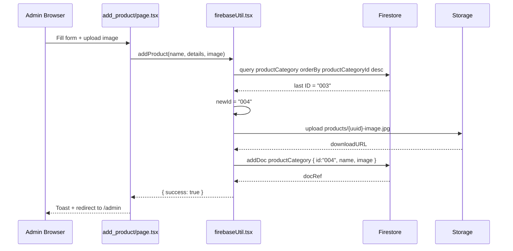

## Batch Creation Flow

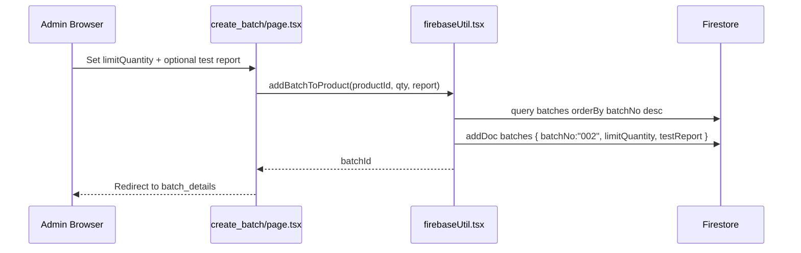

## Packet Creation Flow

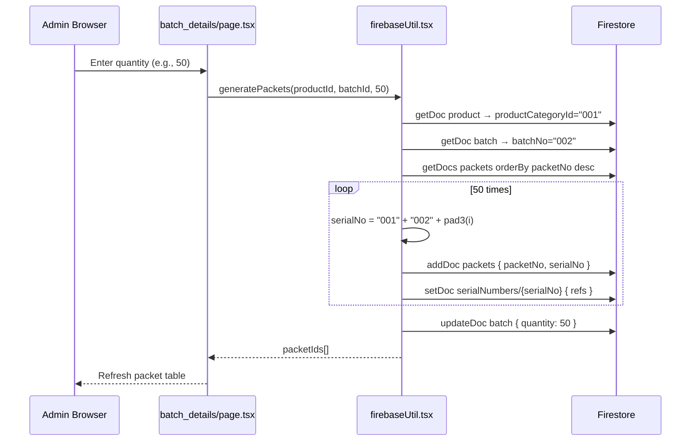

## QR Generation (Original)

**Not implemented.** QR codes were on the roadmap (`README.md` v0.1.0 roadmap) but did not exist until May 2026 traceability module.

## Customer Scan / Lookup Flow (Original)

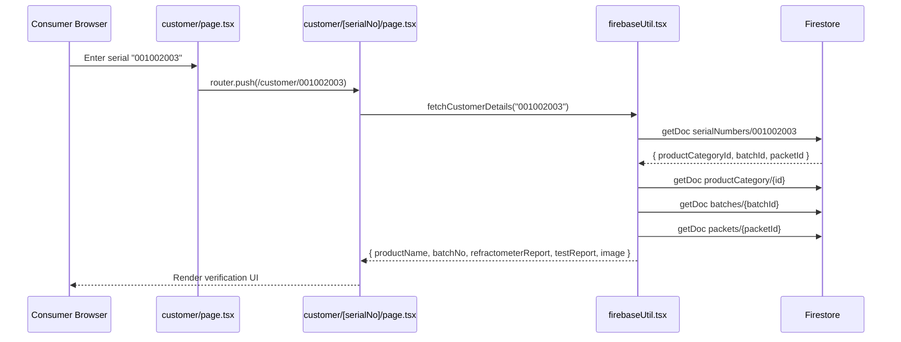

---

# SECTION 6 — PROBLEMS FOUND

## 6.1 Security Problems

### S1: No Authentication on Admin Routes
**Evidence:** Original `src/app/admin/page.tsx` had no auth checks. `middleware.ts` did not exist until Sep 2025 and even then was pass-through.

**Production impact:** Anyone could create/delete products, generate serial numbers, upload files.

### S2: Client-Side Firestore Writes
**Evidence:** `firebaseUtil.tsx` used client SDK `addDoc`, `setDoc`, `updateDoc` directly from browser.

**Production impact:** Firestore security rules were the only barrier. Without rules, full database write access from any browser.

### S3: Role Escalation via Client
**Evidence:** Original `POST /api/create-user` (Sep 2025) accepted `role` from request body. Fixed in uncommitted changes — role now server-assigned only.

**Production impact:** Any user could self-assign `admin` role.

### S4: Public Read of Entire Product Tree
**Evidence:** `firestore.rules` (uncommitted) allows `allow read: if true` on `productCategory` and nested collections.

**Production impact:** Acceptable for customer verification but exposes all product/batch/packet data to enumeration.

### S5: No IDOR Protection on APIs (Pre-Migration)
**Evidence:** When client-side util was used, there was no concept of "whose data" — any authenticated or unauthenticated client with Firestore access could read/write any document.

### S6: Storage Rules Too Permissive (Original)
**Evidence:** No `storage.rules` in original repo. Default Firebase rules often allow authenticated writes.

## 6.2 Performance Problems

### P1: N+1 Writes in Packet Generation
**Evidence:** `generatePackets` loop does sequential `addDoc` + `setDoc` per packet (50 packets = 100 sequential writes).

```typescript
// Original firebaseUtil.tsx — sequential loop
for (let i = 1; i <= quantity; i++) {
  const packetRef = await addDoc(packetCollectionRef, { ... });
  await setDoc(doc(db, "serialNumbers", serialNo), { ... });
}
```

**Production impact:** Generating 500 packets = 1000+ sequential network round-trips. Timeouts on slow connections.

### P2: Full Collection Scan for Product ID Generation
**Evidence:** `addProduct` queries ALL products ordered by `productCategoryId` desc to find latest ID.

**Production impact:** O(n) reads grow with product catalog size.

### P3: Customer Lookup = 4 Sequential Reads
**Evidence:** `fetchCustomerDetails` reads index then 3 nested documents sequentially.

**Production impact:** ~200-400ms per lookup; no caching.

### P4: Firestore Read on Every API Auth Check (Pre-Claims)
**Evidence:** Before JWT custom claims, `requireTraceabilityAdmin` read `users/{uid}` on every API call.

**Production impact:** Doubled Firestore reads for authenticated operations.

### P5: Nested Collection Traversal
**Evidence:** Path `productCategory/{id}/batches/{id}/packets/{id}` requires knowing parent IDs for every query.

**Production impact:** Cannot query "all packets across all products" without collection group queries (expensive).

## 6.3 Architecture Problems

### A1: God Object (`firebaseUtil.tsx`)
**Evidence:** 679+ lines, 15+ exported functions, mixed concerns (CRUD + storage + lookup + ID generation).

**Production impact:** Impossible to test individual operations; changes risk breaking unrelated features.

### A2: Fat Page Components
**Evidence:** Original `batch_details/page.tsx` was 500+ lines with inline state, fetch, generate, delete logic.

**Production impact:** High bug rate; difficult onboarding.

### A3: Fragmented Batch Workflow
**Evidence:** Three separate routes: `batch_details`, `existing_packets`, `add_refractometer_report`.

**Production impact:** Admin must navigate between pages for one workflow.

### A4: No API Layer
**Evidence:** No `src/app/api/` in initial commit.

**Production impact:** No server-side validation, no rate limiting, no audit logging.

### A5: Dual Data Models Without Bridge (May 2026)
**Evidence:** Traceability module added flat collections but admin still used `firebaseUtil` for legacy nested model. No dual-read until uncommitted `legacy-resolve.ts`.

**Production impact:** Customer lookup broke for migrated packets unless both models synced.

## 6.4 Maintainability Problems

### M1: No TypeScript Types for Firestore Documents
**Evidence:** Original util used `any` spread from `doc.data()`.

### M2: No Error Boundaries or Consistent Error Handling
**Evidence:** Mix of `return null`, `return []`, `return { success: false }`, `throw Error`.

### M3: Hardcoded "undefined" Serial Prefix Bug
**Evidence:** Legacy packets created before `productCategoryId` was set got serials like `undefined002003`. Repair logic added in `legacy-admin/packets.ts` and `legacy-resolve.ts`.

```typescript
// legacy-admin/packets.ts
if (serialNo?.startsWith("undefined")) {
  serialNo = serialNo.replace("undefined", productNo);
}
```

### M4: README Out of Sync
**Evidence:** README still describes `firebaseUtil` as primary API; roadmap lists QR as TODO but QR was implemented in May 2026.

## 6.5 Scalability Problems

### SC1: Serial Index as Flat Collection
**Evidence:** `serialNumbers/{serialNo}` — doc ID = serial. Works for O(1) lookup but no sharding.

**Impact:** Fine at thousands of packets; potential hotspot at millions of writes during bulk generation.

### SC2: No Pagination on Admin Lists
**Evidence:** `fetchProductCategories()` and `fetchPacketDetails()` load entire collections.

### SC3: No Event Sourcing / Audit Trail
**Evidence:** Original model had no `traceabilityEvents`. Changes were silent.

## 6.6 Database Design Problems

### D1: Nested Collections Prevent Cross-Product Queries
**Evidence:** Packets buried 3 levels deep under product → batch.

### D2: Denormalized `quantity` on Batch Can Drift
**Evidence:** `quantity` incremented client-side; no transactional guarantee with packet count.

### D3: Duplicate Product Documents
**Evidence:** `products` collection added later (sync script) duplicates `productCategory` data.

## 6.7 Developer Experience Problems

### DX1: No Local Security Rules in Repo (Original)
### DX2: No Migration Scripts (Original)
### DX3: No Structured Logging
### DX4: Empty `src/services/` Directory (Current — placeholder never used)

---

# SECTION 7 — WHY EACH CHANGE WAS MADE

## Change 1: Firebase Authentication (Sep 2025, `8ee022a`)

| | |
|---|---|
| **Problem** | Admin routes completely open |
| **Root Cause** | No auth system implemented; login was stub |
| **Solution** | Firebase Auth + `AuthContext` + `users` collection + API routes |
| **Implementation** | `src/contexts/AuthContext.tsx`, `/api/create-user`, `/api/get-user`, `middleware.ts` |
| **Result** | Admin must login; user profiles stored in Firestore; role-based UI |

## Change 2: Traceability Platform (May 2026, `501bc95`) — **REMOVED Jul 2026**

| | |
|---|---|
| **Problem** | Nested Firestore model cannot scale; no QR; no recalls; no audit |
| **Root Cause** | Original design optimized for demo, not production traceability |
| **Solution** | Flat top-level collections + QR alias index + event log + admin UI |
| **Implementation** | `src/lib/traceability/*`, `/api/traceability/*`, `/admin/traceability/*`, `/scan/[token]` |
| **Result** | Added flat platform (later removed — see Change 11) |

## Change 3: Legacy Admin Server APIs (Uncommitted, Jul 2026)

| | |
|---|---|
| **Problem** | Client-side Firestore writes are insecure; `firebaseUtil` is untestable |
| **Root Cause** | All business logic ran in browser with client SDK |
| **Solution** | Server-side data layer + authenticated API routes |
| **Implementation** | `src/lib/legacy-admin/*`, `/api/admin/products/*`, `legacy-admin-client.ts` |
| **Result** | Admin UI calls APIs with Bearer token; Firestore accessed only via Admin SDK |

## Change 4: JWT Custom Claims (Uncommitted, Jul 2026)

| | |
|---|---|
| **Problem** | Every API call required Firestore read to resolve role |
| **Root Cause** | Role stored only in `users` collection, not in token |
| **Solution** | `/api/auth/set-claims` stamps `role` into JWT; clients refresh token after login |
| **Implementation** | `AuthContext` calls set-claims on login; `api-auth.ts` reads `decoded.role` first |
| **Result** | Zero Firestore reads for role resolution on authenticated requests |

## Change 5: Dual-Read Customer Lookup — **SUPERSEDED by Change 11**

| | |
|---|---|
| **Problem** | Migrated packets in flat collections invisible to serial lookup |
| **Root Cause** | Two parallel data models without bridge |
| **Solution** | `resolvePublicCustomerDetails` tries flat → legacy index → nested |
| **Implementation** | Was `legacy-resolve.ts` + `/api/traceability/resolve-serial`; replaced by `customer-serial-resolve.ts` |
| **Result** | Customer lookup works for both old and migrated data |

## Change 6: Firestore + Storage Security Rules (Uncommitted)

| | |
|---|---|
| **Problem** | No rules in repo; client writes possible |
| **Root Cause** | Rules never committed; relied on Firebase Console |
| **Solution** | `firestore.rules`, `storage.rules`, `firebase.json` for deploy |
| **Implementation** | Block client writes; server APIs only; nested-only rules (Jul 2026) |
| **Result** | Defense in depth — even if client SDK misused, writes blocked |

## Change 7: Batch Details Refactor (Uncommitted)

| | |
|---|---|
| **Problem** | 500+ line fat page; refractometer workflow split across 3 routes |
| **Root Cause** | No component extraction; feature grew organically |
| **Solution** | `useBatchDetails` hook + batch components + integrated UI |
| **Implementation** | `src/components/batch/*`, slim `batch_details/page.tsx` |
| **Result** | Single page for generate, filter, sort, refractometer, test report, delete |

## Change 8: Customer Page → API Lookup — **UPDATED in Change 11**

| | |
|---|---|
| **Problem** | Customer page imported `firebaseUtil` directly |
| **Root Cause** | Original client-side architecture |
| **Solution** | `GET /api/customer/resolve-serial?s={serialNo}` (was traceability route) |
| **Implementation** | `customer/[serialNo]/page.tsx` fetches API instead of Firestore |
| **Result** | Server controls lookup logic; dual-read works; no client DB exposure |

## Change 9: Flat Packet Sync — **REMOVED in Change 11**

| | |
|---|---|
| **Problem** | Legacy packet generation didn't create flat traceability documents |
| **Root Cause** | Two systems not wired together |
| **Solution** | `useBatchDetails.syncFlatPackets()` calls traceability API after legacy generate |
| **Implementation** | POST `/api/traceability/batches/{batchId}/packets` with `legacySerialPrefix` |
| **Result** | Dual-write removed; nested-only packet generation |

## Change 11: Nested-Only Simplification (Jul 2026)

| | |
|---|---|
| **Problem** | Flat traceability platform unused; QR not on labels; dual-write added complexity |
| **Root Cause** | May 2026 traceability module built for future scale/features not needed yet |
| **Solution** | Remove flat collections, traceability APIs/UI, dual-read, syncFlatPackets |
| **Implementation** | Delete `lib/traceability/`, `/api/traceability/*`, `/admin/traceability/*`; add `customer-serial-resolve.ts` + `/api/customer/resolve-serial` |
| **Result** | Single nested model; 12 API routes; simpler onboarding and maintenance |

## Change 12: Flat Collection Data Purge (Jul 16, 2026)

| | |
|---|---|
| **Problem** | Orphaned flat traceability documents remained in Firestore after code removal |
| **Root Cause** | May 2026 platform wrote 220 docs to top-level collections; code deletion did not clean data |
| **Solution** | One-off Admin SDK script to delete all documents in flat traceability collections |
| **Implementation** | `scratch/delete_flat_traceability_collections.js` — dry-run by default; `--execute --yes` to delete |
| **Result** | 220 documents removed from `kisan2kitchen-1a068`; nested `productCategory` data untouched; collections now empty |

**Deleted document counts:**

| Collection | Documents deleted |
|------------|-------------------|
| `traceabilityRoots` | 6 |
| `batches` (top-level) | 2 |
| `packets` (top-level) | 60 |
| `traceabilityEvents` | 62 |
| `qrAliases` | 90 |
| `recalls` | 0 |
| `reconciliationJobs` | 0 |
| `productionRuns` | 0 |
| **Total** | **220** |

---

# SECTION 8 — FILE-BY-FILE CHANGES

## Master Change Table

| File | Old Responsibility | New Responsibility | Why Changed | Impact |
|------|-------------------|-------------------|-------------|--------|
| `firebase/firebaseUtil.tsx` | All client Firestore/Storage ops | **DELETED** (uncommitted) | Security; server-side migration | Admin no longer writes from browser |
| `firebase/auth.tsx` | Client auth helpers | **DELETED** | Replaced by `AuthContext` | — |
| `firebase/firebaseConfig.tsx` | Client Firebase init | Client Firebase init (auth only) | Removed db/storage exports from client | Client no longer has Firestore access |
| `src/contexts/AuthContext.tsx` | — | Global auth state, login, claims sync | Sep 2025 auth | All pages share auth |
| `src/lib/api-auth.ts` | — | Bearer token verification, role resolution | Server API auth | Shared by all API routes |
| `src/lib/legacy-admin/*` | — | Server-side legacy CRUD | Replace firebaseUtil | Secure admin operations |
| `src/lib/legacy-admin-client.ts` | — | Client fetch wrappers for `/api/admin/*` | Type-safe API calls | Admin pages use HTTP not Firestore |
| `src/lib/customer-serial-resolve.ts` | — | Nested serial lookup | Replace legacy-resolve | Customer verification |
| `src/lib/traceability/*` | Flat traceability data layer | **DELETED Jul 2026** | Simplification | Removed unused platform |
| `src/lib/traceability/legacy-resolve.ts` | Dual-read bridge | **DELETED** — replaced by `customer-serial-resolve.ts` | Simplification | Nested-only lookup |
| `src/lib/traceability/observability.ts` | API observability | **DELETED** | Platform removed | — |
| `src/components/batch/*` | — | Batch details UI components + hook | Refactor fat page | Maintainable batch workflow |
| `src/app/api/admin/products/*` | — | Legacy admin REST API | Server-side CRUD | Secure product/batch/packet ops |
| `src/app/api/auth/set-claims` | — | JWT custom claim stamping | Performance + auth | Zero Firestore reads for roles |
| `src/app/api/traceability/*` | Traceability REST API | **DELETED Jul 2026** (17 routes) | Simplification | — |
| `src/app/api/customer/resolve-serial` | — | Public serial lookup API | Replace traceability route | Nested-only resolution |
| `src/app/api/verify-token` | Token verification | **DELETED** | Merged into `api-auth.ts` | — |
| `src/app/admin/layout.tsx` | — | Role-based route guard | Centralized auth | Protects all admin routes |
| `src/app/admin/traceability/*` | Operator dashboard | **DELETED Jul 2026** | Simplification | — |
| `src/app/scan/[token]/page.tsx` | QR scan page | **DELETED** | QR not used | — |
| `src/app/customer/[serialNo]/page.tsx` | Direct firebaseUtil call | API fetch to `/api/customer/resolve-serial` | Security + nested lookup | No client Firestore |
| `firestore.rules` | — | Security rules | Defense in depth | Block unauthorized writes |
| `storage.rules` | — | Storage security rules | File upload protection | Admin-only writes |
| `firebase.json` | — | Rules deploy config | CI/CD deploy | Version-controlled rules |
| `scratch/migrate_legacy_to_flat.js` | Flat migration script | **DELETED** | Platform removed | — |
| `scratch/delete_flat_traceability_collections.js` | — | Purge flat Firestore data | Post-simplification cleanup | 220 orphan docs removed Jul 16 2026 |
| `middleware.ts` | — | Admin route matcher (pass-through) | Sep 2025 | Placeholder for future SSR auth |

## Detailed File Changes

### `firebase/firebaseUtil.tsx` → DELETED

**Old logic:**
```typescript
// Client-side direct Firestore access
import { collection, addDoc, getDocs } from "firebase/firestore";
import { db, storage } from "./firebaseConfig";
export const addProduct = async (...) => { await addDoc(collection(db, "productCategory"), ...) };
export const generatePackets = async (...) => { /* sequential loop */ };
export const fetchCustomerDetails = async (serialNo) => { /* 4 reads */ };
```

**New logic:** Functions split across:
- `src/lib/legacy-admin/products.ts` — server Admin SDK
- `src/lib/legacy-admin/batches.ts` — server Admin SDK
- `src/lib/legacy-admin/packets.ts` — server Admin SDK
- `src/lib/traceability/legacy-resolve.ts` — public lookup
- `src/lib/legacy-admin-client.ts` — client HTTP wrappers

**Removed functions:** All 15+ exports from firebaseUtil  
**Added functions:** See legacy-admin and customer-serial-resolve modules  
**Performance:** Batch writes possible (Admin SDK); no client round-trips  
**Security:** Admin SDK uses service account; client never touches Firestore

### `src/contexts/AuthContext.tsx` — NEW (Sep 2025), MODIFIED (Jul 2026)

**Old:** Did not exist. No global auth state.

**New logic:**
```typescript
onAuthStateChanged(auth, async (user) => {
  const tokenResult = await user.getIdTokenResult();
  const claimRole = tokenResult.claims.role;
  if (claimRole) setUserRole(claimRole);  // Fast path — no API call
  else await fetchUserDetails(uid, token); // Fallback
});

login() → signInWithEmailAndPassword → createUserDocument → set-claims → getIdToken(true)
  → if role !== 'admin' → signOut (admin login rejects non-admins)
```

**Auth changes:** Role never sent from client in `createUserDocument`  
**Security:** Admin login hard-rejects non-admin roles

### `src/app/api/create-user/route.ts`

**Old:** Accepted `role` from request body; anyone could set admin.  
**New:** `requireBearerAuth`; `uid` must match token; role set to `"customer"` on first create only; never overwritten.

### `src/components/batch/useBatchDetails.ts` — NEW

**Extracted from:** `batch_details/page.tsx` (500+ lines)

**State managed:**
- `batchDetails`, `packetDetails`, `productCategoryId`, `productName`
- `openGeneratePacket`, `packetQuantity`, `isGenerating`
- `sortKey`, `sortDirection`, `filterType`, `searchQuery`
- `openIndexModal`, `selectedPacketForIndex`, `newIndexValue`
- `openUploadReportDialog`, `uploadReportFile`
- `openDeleteDialog`

**Key functions:**
| Function | API Called | DB Effect |
|----------|-----------|-----------|
| `fetchData` (useEffect) | `legacyAdminFetchBatch`, `FetchProduct`, `FetchPackets` | Read nested collections |
| `handleGeneratePacket` | `legacyAdminGeneratePackets` | Write packets + serialNumbers index |
| `handleUpdateIndex` | `legacyAdminUpdateRefractometer` | Update packet + serial index |
| `handleUploadReport` | `legacyAdminUploadTestReport` | Upload PDF + update batch |
| `handleDeleteBatch` | `legacyAdminDeleteBatch` | Cascade delete packets + serials |

### `src/lib/traceability/admin-writer.ts` — **REMOVED** (was May 2026)

**Key functions:**
| Function | Purpose | Collections Written |
|----------|---------|-------------------|
| `upsertTraceabilityRoot` | Create/update product root | `traceabilityRoots`, `traceabilityEvents` |
| `createBatchDocument` | Create flat batch | `batches`, `traceabilityEvents` |
| `createPacketWithQrAlias` | Single packet + QR | `packets`, `qrAliases`, `traceabilityEvents` |
| `bulkCreatePacketsWithQrAliases` | Bulk packets + QRs | `packets`, `qrAliases`, `traceabilityEvents` |
| `openRecallCase` | Open recall | `recalls`, entity recall flags, `traceabilityEvents` |
| `liftRecallCase` | Close recall | `recalls`, clear flags, `traceabilityEvents` |
| `softVoidPacket` | Void packet | `packets`, `traceabilityEvents` |
| `archiveBatch` | Archive batch | `batches`, `traceabilityEvents` |

**QR token generation:**
```typescript
function newQrPublicToken(): string {
  return uuidv4().replace(/-/g, "");  // 32 hex chars
}
```

---

# SECTION 9 — FOLDER STRUCTURE CHANGES

## OLD → NEW Tree

```
OLD (Jun 2025)                          NEW (Jul 2026 — committed + uncommitted)
──────────────                          ─────────────────────────────────────────
firebase/                               firebase/
  auth.tsx                    ──X──►      (deleted)
  firebaseConfig.tsx          ──►         firebaseConfig.tsx (auth only)
  firebaseUtil.tsx            ──X──►      (deleted → legacy-admin/ + customer-serial-resolve)

src/app/                                src/app/
  admin/                                admin/
    page.tsx                  ──►         page.tsx (uses legacy-admin-client)
    add_product/              ──►         add_product/ (uses API)
    add_serialno/             ──X──►      (deleted)
    [productId]/              ──►         [productId]/
      create_batch/           ──►           create_batch/ (uses API)
      [batchId]/                          [batchId]/
        batch_details/        ──►           batch_details/ (hook + components)
        existing_packets/     ──X──►      (deleted → integrated in batch_details)
        add_refractometer/    ──X──►      (deleted → RefractometerIndexDialog)
    (removed)                 ──X──►      traceability/ dashboard deleted Jul 2026
  api/                        ──NEW──►  api/
                                          admin/products/... (legacy REST)
                                          auth/set-claims
                                          create-user, get-user
                                          customer/resolve-serial (public lookup)
  customer/                   ──►         customer/ (API-based lookup)
  scan/[token]/               ──X──►      (deleted — QR not used)
  login/pages.tsx             ──►         login/page.tsx (fixed typo)

src/components/                         src/components/
  ui/                         ──►         ui/ (unchanged)
                              ──NEW──►  batch/ (BatchDetailsHeader, useBatchDetails, etc.)
                              (removed) traceability admin shell deleted
                              ──NEW──►  Loader.tsx, Navbar.tsx

src/contexts/                 ──NEW──►  AuthContext.tsx
src/lib/                                  src/lib/
  utils.ts                    ──►         utils.ts
                              ──NEW──►  api-auth.ts
                              ──NEW──►  firebase-admin.ts
                              ──NEW──►  legacy-admin-client.ts
                              (removed) traceability-client.ts deleted
                              ──NEW──►  legacy-admin/ (server data layer)
                              ──NEW──►  traceability/ (platform data layer)
src/services/ (empty)         ──NEW──►  services/ (still empty — placeholder)

                              ──NEW──►  firestore.rules, storage.rules, firebase.json
                              ──NEW──►  firestore.indexes.json
                              ──NEW──►  scratch/ (migration scripts)
                              ──NEW──►  middleware.ts
```

## Why Folders Moved / Added / Removed

| Change | Reason |
|--------|--------|
| **Deleted `firebase/firebaseUtil.tsx`** | Security: client must not write to Firestore |
| **Added `src/lib/legacy-admin/`** | Server-side repository for legacy nested model |
| **Added then removed `src/lib/traceability/`** | Flat platform (May 2026); deleted Jul 2026 |
| **Added `src/app/api/admin/`** | REST API boundary for admin operations |
| **Added then removed `src/app/api/traceability/`** | 17 routes; deleted Jul 2026 |
| **Added `src/components/batch/`** | Extract domain components from fat pages |
| **Added then removed `src/app/admin/traceability/`** | Operator UI; deleted Jul 2026 |
| **Deleted `add_serialno/`** | Functionality absorbed into batch_details |
| **Deleted `existing_packets/`** | Filter in batch_details packet table |
| **Deleted `add_refractometer_report/`** | `RefractometerIndexDialog` component |
| **Added `scratch/`** | One-off migration/maintenance scripts (not in app bundle); includes flat collection purge script |
| **Renamed `login/pages.tsx` → `page.tsx`** | Next.js App Router convention |

---

# SECTION 10 — ARCHITECTURE CHANGES

## OLD Architecture Diagram

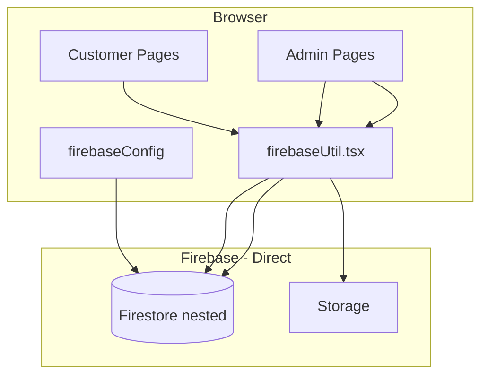

## NEW Architecture Diagram (Final — Jul 2026)

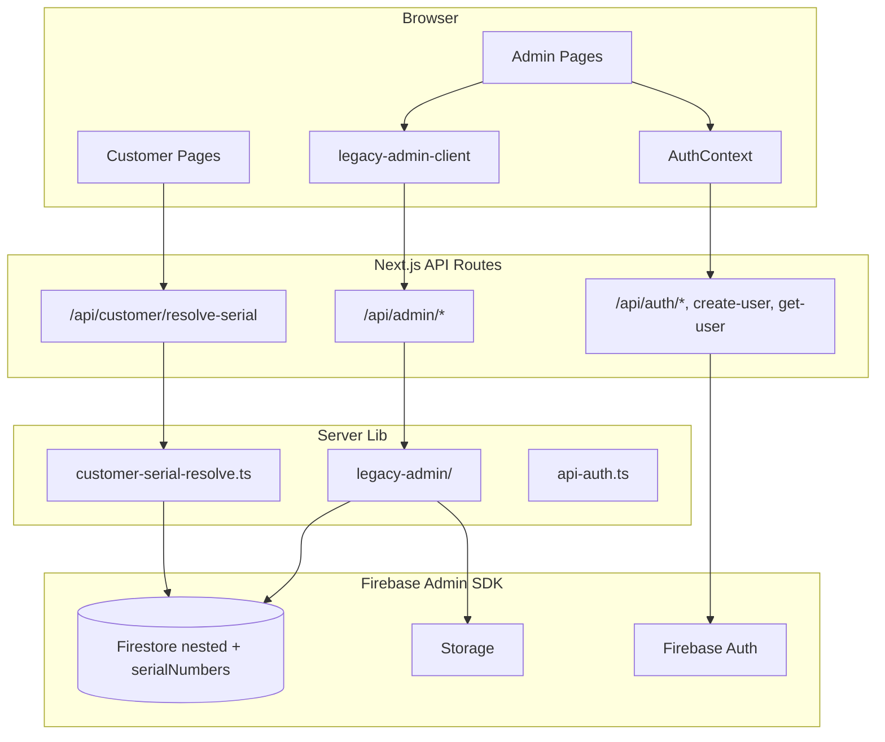

> **Historical note:** May 2026 briefly added a parallel flat traceability platform (`/api/traceability/*`). Removed Jul 2026 — nested `productCategory` + serial numbers meet current needs.

## Request Lifecycle (Current)

### Authenticated Admin Request
```
1. Browser: user.getIdToken() → Bearer token
2. Browser: fetch("/api/admin/products", { Authorization: Bearer {token} })
3. API Route: requireLegacyAdmin(request)
   a. requireBearerAuth → admin.auth().verifyIdToken(token)
   b. resolveUserRole → decoded.role (JWT claim) OR users/{uid} fallback
   c. isAdminRole(role) → must be "admin"
4. API Route: calls legacy-admin function (e.g., listProductCategories)
5. Server lib: admin.firestore().collection("productCategory").get()
6. Response: JSON { ok: true, products: [...] }
```

### Public Customer Request
```
1. Browser: fetch("/api/customer/resolve-serial?s=001002003")
2. resolveCustomerSerialDetails(db, serial)
   a. getDoc serialNumbers/{serial}
   b. Fallback: repair "undefined" prefix if needed
   c. Parallel read: productCategory, batch, packet
3. Response: JSON { ok: true, data: { productName, batchNo, ... } }
```

---

# SECTION 11 — ADMIN MODULE

## Admin Route Map (Current)

```
/admin                                    → Product dashboard
/admin/add_product                        → Create product
/admin/[productId]/create_batch           → Create batch
/admin/[productId]/[batchId]/batch_details  → Batch management (packets, reports)
```

> **Removed:** `/admin/traceability/*` — flat traceability operator dashboard (not needed for nested-only model).

## Admin Login Flow

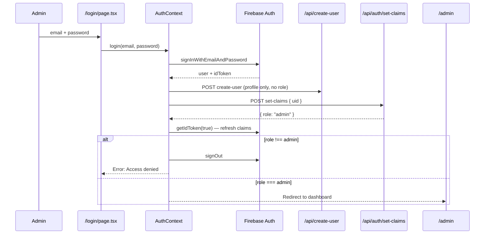

## `src/app/admin/layout.tsx`

**Purpose:** Centralized route guard for all `/admin/*` pages.

**Logic (simplified Jul 2026):**
```typescript
// Admin-only — no traceability operator roles
if (!user || userRole !== "admin") → redirect /login
```

## `/admin` — Product Dashboard

**File:** `src/app/admin/page.tsx`  
**Auth:** `userRole === 'admin'`  
**Data fetch:** `legacyAdminFetchProducts(user)` → `GET /api/admin/products`  
**DB:** Reads `productCategory` collection  

## `/admin/add_product` — Create Product

**API:** `POST /api/admin/products` (multipart form)  
**Server:** `legacy-admin/products.ts → addProduct()`  
**DB writes:** `productCategory`, `products` mirror, Storage `products/`

## `/admin/[productId]/create_batch` — Create Batch

**API:** `POST /api/admin/products/{productId}/batches`  
**Server:** `legacy-admin/batches.ts → addBatchToProduct()`  
**DB writes:** nested `batches` subcollection, `batchCount` increment, Storage `testReport/`

## `/admin/[productId]/[batchId]/batch_details` — Batch Management

**File:** `src/app/admin/[productId]/[batchId]/batch_details/page.tsx` (111 lines)  
**Hook:** `useBatchDetails({ user, productId, batchId })`  

**Components:**
| Component | Purpose |
|-----------|---------|
| `BatchDetailsHeader` | Product name, batch number, navigation |
| `BatchStatsCards` | Packet count, reports filled, limit |
| `PacketInventoryTable` | Sortable/filterable packet table |
| `GeneratePacketsDialog` | Bulk packet generation |
| `RefractometerIndexDialog` | Per-packet quality reading |
| `UploadTestReportDialog` | Batch lab test PDF upload |
| `DeleteBatchDialog` | Cascade delete confirmation |
| `packet-utils.ts` | Filter, sort, Excel export |

**APIs used (all `/api/admin/*`):**
| Action | Method | Endpoint |
|--------|--------|----------|
| Load batch | GET | `/api/admin/products/{pid}/batches/{bid}` |
| Load packets | GET | `/api/admin/products/{pid}/batches/{bid}/packets` |
| Generate packets | POST | `/api/admin/products/{pid}/batches/{bid}/packets/generate` |
| Update refractometer | PATCH | `/api/admin/products/{pid}/batches/{bid}/packets/{pktId}` |
| Upload test report | POST | `/api/admin/products/{pid}/batches/{bid}/test-report` |
| Delete batch | DELETE | `/api/admin/products/{pid}/batches/{bid}` |

> **Removed:** `syncFlatPackets` POST to `/api/traceability/batches/{bid}/packets` — no dual-write to flat collections.

---

# SECTION 12 — CUSTOMER MODULE

## Customer Route Map (Current)

```
/customer                    → Serial number search form (public)
/customer/[serialNo]         → Verification results (public)
```

> **Removed:** `/scan/[token]` — QR scan page (QR not implemented on labels).

## Customer Search Flow

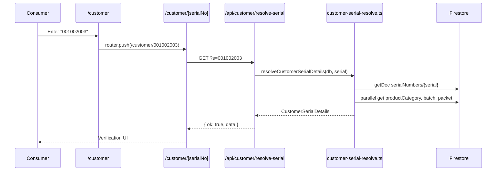

## `/customer` — Search Page

**File:** `src/app/customer/page.tsx`  
**Auth:** None (public)  
**Flow:** Serial input → `router.push(/customer/{serialNo})`

## `/customer/[serialNo]` — Results Page

**File:** `src/app/customer/[serialNo]/page.tsx`  
**API:** `GET /api/customer/resolve-serial?s={serialNo}`  
**Server:** `src/lib/customer-serial-resolve.ts`

**Lookup path (nested only):**
1. `serialNumbers/{serialNo}` → get `productCategoryId`, `batchId`, `packetId`
2. Fallback: repair `undefined` prefix serials (legacy data bug)
3. Parallel read: `productCategory/{id}`, `batches/{bid}`, `packets/{pid}`
4. Return product name, image, batch no, test report, refractometer value

## Customer Module — Collections Accessed

| Collection | Purpose |
|-----------|---------|
| `serialNumbers` | O(1) serial → document refs |
| `productCategory` | Product display info |
| `productCategory/.../batches` | Batch number, test report URL |
| `productCategory/.../packets` | Refractometer reading |

---

# SECTION 13 — DATABASE CHANGES

## Current Schema (Nested Only)

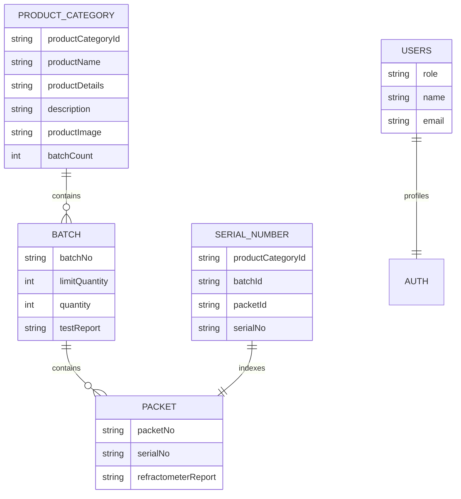

## Collection Summary (Current)

| Collection | Status | Purpose |
|-----------|--------|---------|
| `productCategory` | **Active** | Product catalog |
| `productCategory/.../batches` | **Active** | Nested batches |
| `productCategory/.../packets` | **Active** | Nested packets |
| `serialNumbers` | **Active** | Customer serial lookup index |
| `users` | **Active** | Auth profiles + roles |
| `products` | **Active** | Mirror of productCategory (inventory prep) |
| `categories` | Optional | Inventory categories (rules only) |
| `traceabilityRoots` | **Purged** | Was flat model anchor — 6 docs deleted Jul 16 2026 |
| `batches` (top-level) | **Purged** | Was flat batch store — 2 docs deleted |
| `packets` (top-level) | **Purged** | Was flat packet store — 60 docs deleted |
| `qrAliases` | **Purged** | Was QR O(1) lookup — 90 docs deleted |
| `traceabilityEvents` | **Purged** | Was audit log — 62 docs deleted |
| `recalls` | **Empty** | Was recall management — 0 docs |
| `reconciliationJobs` | **Empty** | Was integrity scans — 0 docs |
| `productionRuns` | **Empty** | Optional flat collection — 0 docs |

## Serial Number Format

```
serialNo = {productCategoryId}{batchNo}{packetNo}
Example:  product=001, batch=002, packet=003 → "001002003"
```

## Firestore Indexes (`firestore.indexes.json`)

**Current:** Empty (`"indexes": []`) — nested model does not require composite indexes for current queries.

## Maintenance Scripts

| Script | Purpose | Status |
|--------|---------|--------|
| `scratch/sync_product_ids_and_serials.js` | Fix legacy `undefined` serial prefixes; sync `products` mirror | **Active** |
| `scratch/delete_flat_traceability_collections.js` | Delete orphaned flat traceability collections (dry-run default) | **Ran Jul 16 2026** — 220 docs purged |
| `scratch/migrate_legacy_to_flat.js` | Legacy → flat migration | **Deleted** (source removed) |

**Purge script usage:**
```bash
# Dry-run (count only)
node scratch/delete_flat_traceability_collections.js

# Delete all flat collection documents
node scratch/delete_flat_traceability_collections.js --execute --yes
```

---

# SECTION 14 — AUTHENTICATION CHANGES

## Current Authentication

| Aspect | Behavior |
|--------|----------|
| Login | Email/password (admin) + phone OTP (customers) |
| Session | Firebase session + JWT ID tokens |
| Roles in use | `admin`, `customer` (traceability operator roles unused) |
| Role storage | Firestore `users/{uid}.role` + JWT custom claim |
| API protection | `requireBearerAuth` / `requireLegacyAdmin` |
| Page protection | `admin/layout.tsx` — `userRole === "admin"` only |
| Token refresh | `getIdToken(true)` after `/api/auth/set-claims` |

## Role → Access Matrix (Current)

| Role | Admin `/admin` | Customer `/customer` |
|------|---------------|---------------------|
| `admin` | ✅ Full | ✅ Public |
| `customer` | ❌ | ✅ Public |
| unauthenticated | ❌ | ✅ Public |

> **Removed roles** (were for `/admin/traceability`): `inventory_admin`, `traceability_admin`, `quality_admin`, `viewer`

---

# SECTION 15 — API CHANGES

## Current API Catalog

### Auth & Users

| Endpoint | Methods | Auth | Purpose |
|----------|---------|------|---------|
| `POST /api/auth/set-claims` | POST | Bearer | Stamp JWT `role` claim from Firestore |
| `POST /api/create-user` | POST | Bearer (self) | Upsert profile; role server-assigned |
| `GET /api/get-user?uid=` | GET | Bearer (self/admin) | Fetch user profile |

### Legacy Admin (`/api/admin/*`) — 9 route files

| Endpoint | Methods | Auth | DB |
|----------|---------|------|-----|
| `/api/admin/products` | GET, POST | admin | `productCategory`, `products`, Storage |
| `/api/admin/products/[productId]` | GET, DELETE | admin | `productCategory` |
| `/api/admin/products/[productId]/batches` | GET, POST | admin | nested `batches` |
| `/api/admin/products/[productId]/batches/[batchId]` | GET, DELETE | admin | nested + `serialNumbers` cascade |
| `.../test-report` | POST | admin | Storage + batch update |
| `.../packets` | GET, POST | admin | nested `packets` + `serialNumbers` |
| `.../packets/generate` | POST | admin | bulk packets + serials |
| `.../packets/[packetId]` | PATCH | admin | packet + serial index repair |

### Customer (Public)

| Endpoint | Methods | Auth | DB |
|----------|---------|------|-----|
| `GET /api/customer/resolve-serial?s=` | GET | **None** | `serialNumbers` → nested docs |

> **Removed:** All `/api/traceability/*` routes (17 files) including `resolve-qr`, `packets`, `batches`, recalls, integrity, QR verify/export.

---

# SECTION 16 — SECURITY CHANGES

## Current Firestore Rules (`firestore.rules`)

```
users/{userId}           → read: own doc; write: BLOCKED (server APIs only)
serialNumbers/{serial}   → read: PUBLIC; write: admin token
productCategory/**       → read: PUBLIC; write: admin token
products/{productId}     → read: PUBLIC; write: admin token
categories/**            → read: PUBLIC; write: admin token
```

**Design principle:** Admin writes go through server APIs with Admin SDK. Client direct writes blocked for `users`; product data writes require admin JWT claim.

> **Removed:** Flat collection rules (`traceabilityRoots`, `batches`, `packets`, `qrAliases`, `recalls`, `traceabilityEvents`, `reconciliationJobs`) and `isTraceabilityOperator()` function.

## Storage Rules (`storage.rules`)

```
products/**     → read: PUBLIC; write: admin
testReports/**  → read: admin; write: admin
**              → read/write: admin (catch-all)
```

## Input Validation

| Input | Server validation |
|-------|------------------|
| Product name | Required on `POST /api/admin/products` |
| Batch quantity | Required on batch/packet create |
| Serial lookup | Trim + empty check; 404 if not in index |
| File uploads | Server receives Buffer via FormData; Admin SDK upload |
| Role | Never accepted from client body on `create-user` |

---

# SECTION 17 — PERFORMANCE CHANGES

## Current Performance Profile

| Operation | Reads/Writes | Notes |
|-----------|-------------|-------|
| Customer serial lookup | 4 reads | 1 index + 3 parallel nested docs |
| API auth (with claims) | 0 extra Firestore reads | Role from JWT claim |
| API auth (legacy token) | 1 read | Fallback `users/{uid}` |
| Generate N packets | N×2 writes + 1 batch update | Server-side loop in `legacy-admin/packets.ts` |
| Delete batch | 1 subcollection scan + writeBatch | Atomic cascade |
| Product list | 1 collection scan | No pagination yet |

## Optimizations in Place

| Optimization | Implementation |
|-------------|----------------|
| JWT custom claims | `/api/auth/set-claims` — role in token, no Firestore read per request |
| Serial index | `serialNumbers/{serial}` doc ID = serial — O(1) lookup |
| Parallel nested reads | `Promise.all` for product + batch + packet on customer lookup |
| Server-side writes | Admin SDK in API routes — no browser round-trips |
| Batch delete | Firestore `writeBatch` for atomic packet + serial cleanup |

## Deferred (Not Needed at Current Scale)

| Feature | Why deferred |
|---------|-------------|
| Flat collections | Nested model sufficient for product-scoped operations |
| QR `qrAliases` index | QR not on product labels yet |
| Pagination on admin lists | Small catalog size |
| Denormalized packet counts | `batch.quantity` field sufficient |

---

# SECTION 18 — COMPLETE DATA FLOW

## Admin Data Flow

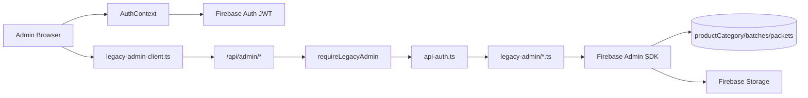

## Customer Data Flow

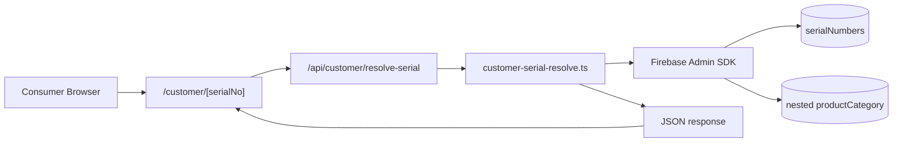

## Packet Generation Flow

```
Admin clicks "Generate N Packets"
  → POST /api/admin/products/{pid}/batches/{bid}/packets/generate
  → legacy-admin/packets.ts → generatePackets()
      ├─ Read productCategoryId + batchNo
      ├─ Loop N times:
      │    ├─ addDoc productCategory/.../packets { packetNo, serialNo }
      │    └─ setDoc serialNumbers/{serialNo} { refs }
      └─ updateDoc batch { quantity }
  → No flat collection write (removed syncFlatPackets)
```

---

# SECTION 19 — COMPLETE BEFORE VS AFTER TABLE

| Area | Originally (Jun 2025) | After Auth (Sep 2025) | After Traceability (May 2026) | **Final (Jul 2026)** |
|------|----------------------|----------------------|------------------------------|---------------------|
| **Data model** | Nested only | Nested only | Dual nested + flat | **Nested only** |
| **Admin data access** | Client firebaseUtil | Client firebaseUtil | Client + traceability APIs | **Server legacy-admin APIs** |
| **Customer lookup** | Client firebaseUtil | Client firebaseUtil | Dual-read API | **Nested-only API** |
| **QR** | None | None | QR routes + scan page | **Removed (not needed)** |
| **Auth** | None | Firebase Auth + users | + JWT claims | **JWT claims + admin-only layout** |
| **API count** | 0 | 3 user routes | 20+ traceability routes | **12 routes (admin + auth + customer)** |
| **Firestore rules** | None in repo | None in repo | Flat + nested rules | **Nested-only rules** |
| **Admin UI routes** | 7 pages | 7 pages | + 8 traceability pages | **4 pages (simplified)** |
| **lib modules** | firebaseUtil | firebaseUtil | + traceability/ | **legacy-admin/ + customer-serial-resolve** |
| **Migration scripts** | None | None | migrate_legacy_to_flat.js | **sync_product_ids + delete_flat (purged Jul 16)** |
| **Flat Firestore data** | None | None | 220 docs in flat collections | **Purged — 0 docs remaining** |

---

# SECTION 20 — DEVELOPER ONBOARDING

## Where to Start

1. Read **Current Architecture** section at top of this document
2. Read `README.md` and `FIREBASE_AUTH_SETUP.md` for env setup
3. Run `npm install && npm run dev`
4. Configure `.env` with Firebase client + admin credentials

## Required Environment Variables

```env
NEXT_PUBLIC_FIREBASE_API_KEY=
NEXT_PUBLIC_FIREBASE_AUTH_DOMAIN=
NEXT_PUBLIC_FIREBASE_PROJECT_ID=
NEXT_PUBLIC_FIREBASE_STORAGE_BUCKET=
NEXT_PUBLIC_FIREBASE_MESSAGING_SENDER_ID=
NEXT_PUBLIC_FIREBASE_APP_ID=
FIREBASE_PROJECT_ID=
FIREBASE_CLIENT_EMAIL=
FIREBASE_PRIVATE_KEY=
```

## Folder Walkthrough (Read Order)

| Order | Path | What to understand |
|-------|------|-------------------|
| 1 | `firebase/firebaseConfig.tsx` | Client auth init |
| 2 | `src/contexts/AuthContext.tsx` | Login + roles + claims |
| 3 | `src/lib/api-auth.ts` | Token verification |
| 4 | `src/lib/legacy-admin/` | Server product/batch/packet logic |
| 5 | `src/lib/legacy-admin-client.ts` | Admin page → API calls |
| 6 | `src/lib/customer-serial-resolve.ts` | Customer serial lookup |
| 7 | `src/app/api/admin/` | Admin REST endpoints |
| 8 | `src/app/api/customer/resolve-serial/` | Public lookup endpoint |
| 9 | `src/components/batch/` | Batch details UI |
| 10 | `firestore.rules` | Security model |

## Execution Flow (Quick Reference)

```
Admin:    login → AuthContext → legacy-admin-client → /api/admin → legacy-admin → Firestore
Customer: /customer/{serial} → /api/customer/resolve-serial → customer-serial-resolve → Firestore
```

## Debugging

| Symptom | Check |
|---------|-------|
| Admin redirect to login | `userRole === 'admin'` in AuthContext + layout |
| 401 on admin API | Token expiry → `user.getIdToken(true)` |
| Serial not found | `serialNumbers/{serial}` exists? Nested packet exists? |
| Serial starts with "undefined" | Run `scratch/sync_product_ids_and_serials.js` |
| Firebase Admin 503 | `.env` admin credentials |

## Adding Features

### New Admin Feature
1. Add server function in `src/lib/legacy-admin/`
2. Add API route in `src/app/api/admin/`
3. Add client wrapper in `legacy-admin-client.ts`
4. Use from admin page with `useAuth()` token

### New Customer Feature
1. Add public API in `src/app/api/customer/`
2. Use Admin SDK server-side only
3. Never import Firestore client SDK in pages

---

# SECTION 21 — FINAL ARCHITECTURE

## System Architecture (Jul 2026 — Nested Only)

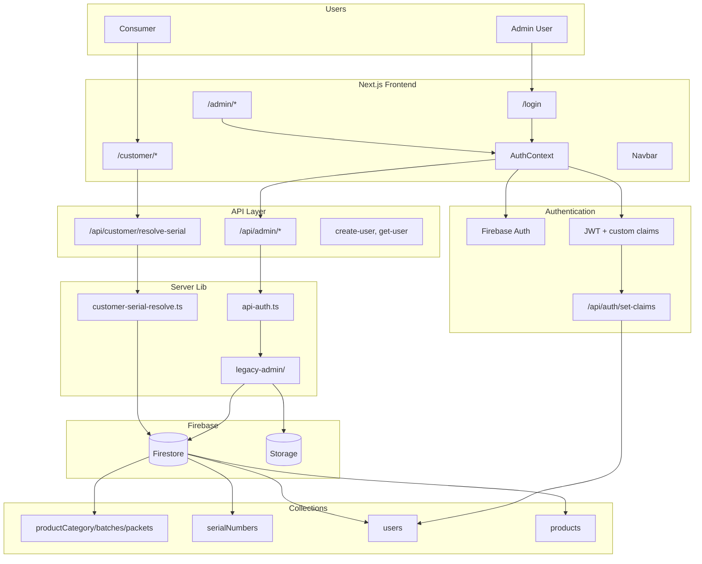

## Connection Summary

| From | To | Purpose |
|------|----|---------|
| Admin Browser | Firebase Auth | Login session |
| Admin Browser | `/api/admin/*` | Product/batch/packet CRUD |
| Consumer Browser | `/api/customer/resolve-serial` | Serial verification |
| API Routes | Firebase Admin SDK | All Firestore/Storage access |
| set-claims | Firestore `users` + Firebase Auth | Role → JWT claim |

## Evolution Summary

| Phase | Architecture | Status |
|-------|-------------|--------|
| 1. Jun 2025 | Client firebaseUtil monolith | Superseded |
| 2. Sep 2025 | + Firebase Auth + user APIs | Foundation kept |
| 3. May 2026 | + Flat traceability platform | **Removed** — over-engineered for current needs |
| 4. Jul 2026 | Legacy-admin server APIs | **Current admin layer** |
| 5. Jul 2026 | Nested-only simplification | **Current final state** |
| 6. Jul 16 2026 | Flat Firestore data purge | **Complete** — 220 orphan docs deleted |

**Rationale for simplification:** Product uses nested `productCategory` with serial numbers on labels. QR codes are not printed. Flat collections, dual-write, and traceability operator UI added complexity without business value. The final architecture keeps security wins (server APIs, auth, rules) and removes unused infrastructure. Orphaned flat data was purged Jul 16, 2026 after code removal.

---

# APPENDIX A — CURRENT FOLDER TREE (Jul 2026)

```
k2k_traceability/
├── firebase.json, firestore.rules, firestore.indexes.json, storage.rules
├── middleware.ts, next.config.mjs, package.json
├── PROJECT_EVOLUTION_REPORT.md
├── scratch/sync_product_ids_and_serials.js
├── scratch/delete_flat_traceability_collections.js
├── firebase/firebaseConfig.tsx          # Client auth only
├── public/images/, product placeholders
└── src/
    ├── app/
    │   ├── layout.tsx, page.tsx, globals.css
    │   ├── login/page.tsx, unauthorized/page.tsx
    │   ├── admin/
    │   │   ├── layout.tsx               # admin-only guard
    │   │   ├── page.tsx                 # product dashboard
    │   │   ├── add_product/page.tsx
    │   │   └── [productId]/
    │   │       ├── create_batch/page.tsx
    │   │       └── [batchId]/batch_details/page.tsx
    │   ├── customer/
    │   │   ├── page.tsx
    │   │   └── [serialNo]/page.tsx
    │   └── api/
    │       ├── auth/set-claims/route.ts
    │       ├── create-user/route.ts, get-user/route.ts
    │       ├── admin/products/...       # 9 route files
    │       └── customer/resolve-serial/route.ts
    ├── components/
    │   ├── batch/                       # 10 files (hook + UI)
    │   ├── ui/                          # shadcn primitives
    │   ├── Loader.tsx, Navbar.tsx
    ├── contexts/AuthContext.tsx
    └── lib/
        ├── api-auth.ts, firebase-admin.ts
        ├── legacy-admin-client.ts
        ├── customer-serial-resolve.ts
        ├── legacy-admin/                # products, batches, packets, storage, types
        └── utils.ts
```

**Deleted:**
- `firebase/firebaseUtil.tsx`, `firebase/auth.tsx`
- `src/lib/traceability/` (entire module)
- `src/app/api/traceability/` (entire folder)
- `src/app/admin/traceability/` (entire folder)
- `src/app/scan/`, `src/components/traceability/`
- `src/lib/traceability-client.ts`
- `scratch/migrate_legacy_to_flat.js`

---

# APPENDIX B — CURRENT FILE-BY-FILE ANALYSIS

## `src/lib/customer-serial-resolve.ts` (NEW)

| Function | Purpose | Collections |
|----------|---------|-------------|
| `resolveCustomerSerialDetails` | Serial → product info | `serialNumbers` → nested docs |
| `resolveSerialIndexDoc` | Index lookup + undefined prefix repair | `serialNumbers`, `productCategory` |

## `src/lib/legacy-admin/` — Server Admin Layer

| Module | Key functions |
|--------|--------------|
| `products.ts` | `listProductCategories`, `addProduct`, `deleteProduct` |
| `batches.ts` | `addBatchToProduct`, `deleteBatch`, `updateBatchTestReport` |
| `packets.ts` | `generatePackets`, `addPacketToBatch`, `updateRefractometerReportById` |
| `route-auth.ts` | `requireLegacyAdmin`, `readFormFile` |
| `storage.ts` | `uploadAdminFile` |

## `src/components/batch/useBatchDetails.ts`

Manages batch details page state. Calls **only** `legacy-admin-client` APIs. No traceability coupling.

## `src/lib/legacy-admin-client.ts`

Typed fetch wrappers for all `/api/admin/*` endpoints with Bearer token auth.

---

# APPENDIX C — API ROUTE REFERENCE (Current)

| Route | Methods | Auth |
|-------|---------|------|
| `/api/auth/set-claims` | POST | Bearer |
| `/api/create-user` | POST | Bearer (self) |
| `/api/get-user` | GET | Bearer |
| `/api/admin/products` | GET, POST | admin |
| `/api/admin/products/[productId]` | GET, DELETE | admin |
| `/api/admin/products/[productId]/batches` | GET, POST | admin |
| `/api/admin/products/[productId]/batches/[batchId]` | GET, DELETE | admin |
| `.../test-report` | POST | admin |
| `.../packets` | GET, POST | admin |
| `.../packets/generate` | POST | admin |
| `.../packets/[packetId]` | PATCH | admin |
| `/api/customer/resolve-serial` | GET | **Public** |

**Total: 12 API route files**

---

# APPENDIX D — FILE DEPENDENCY DIAGRAM (Current)

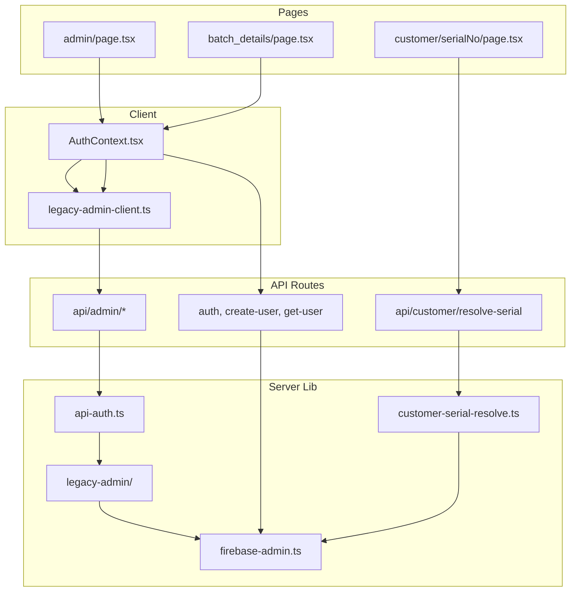

---

# APPENDIX E — GLOSSARY

| Term | Definition |
|------|-----------|
| **productCategoryId** | 3-digit product code (e.g., `001`) on labels |
| **batchNo** | 3-digit batch number within a product |
| **packetNo** | 3-digit packet number within a batch |
| **serialNo** | 9-digit: `{productCategoryId}{batchNo}{packetNo}` |
| **nested model** | `productCategory/{id}/batches/{id}/packets/{id}` |
| **serialNumbers index** | Top-level collection; doc ID = serial for O(1) lookup |
| **legacy-admin** | Server module for nested model CRUD via Admin SDK |
| **custom claim** | `role` in JWT via `setCustomUserClaims` |
| **refractometer report** | Per-packet quality value (e.g., `2.8` for mustard oil) |
| **test report** | Batch-level lab test PDF in Firebase Storage |

**Historical terms (removed architecture):**
| Term | Was |
|------|-----|
| flat model | Top-level `batches`, `packets`, `qrAliases` — code removed Jul 2026; **data purged Jul 16 2026** (220 docs) |
| dual-read | Flat-first then nested lookup — removed |
| traceabilityRoot | Flat model product anchor — removed |
| QR token | 32-hex QR URL token — not implemented on labels |

---

*End of K2K Traceability Project Evolution Report — Version 2.1*
